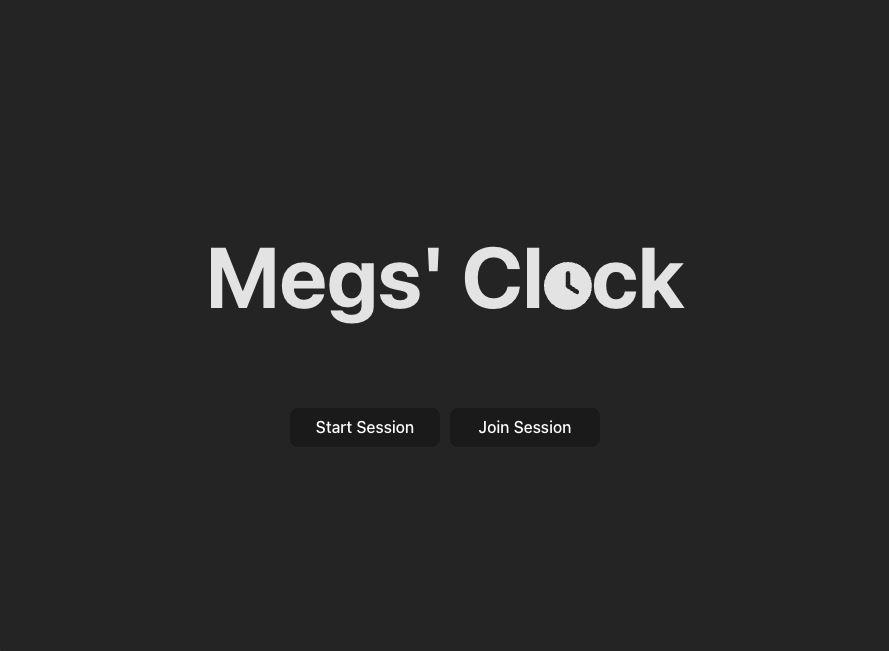
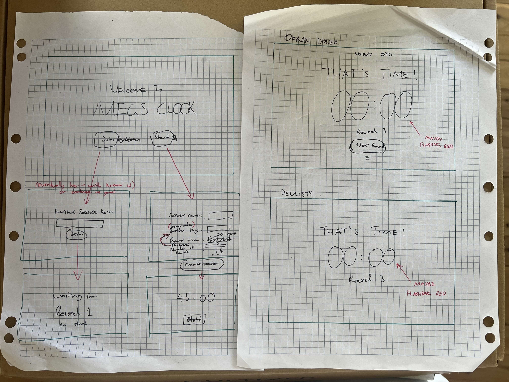
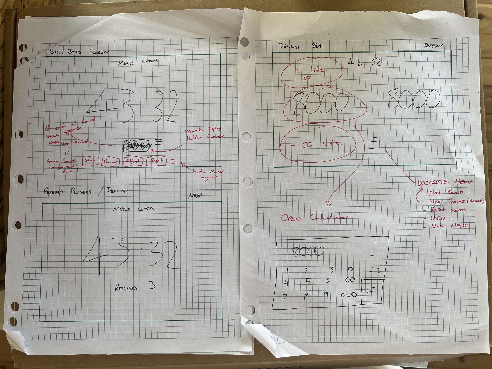
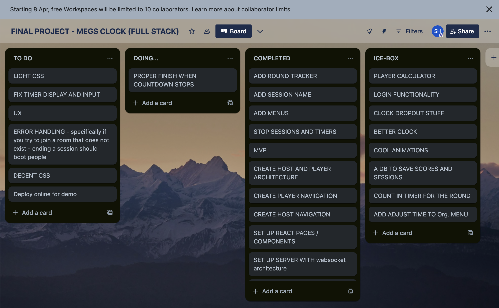

# Megs' Clock

Megs Clock is a countdown timer which can be synchronised and aligned with for personal reference to a specific countdown time. It uses websocket, server side design with the socket.io library. 
Playing a TCG, starting a group test or playing some weekend warrior soccer and need to know how many precious seconds you have to score 4 goals for the win? Check out Meg's Clock

This is the react repo where you can see what is happening client side. If you want to see the code for the server and checkout some websocket techiness, check [this](https://github.com/ScottHugs/megs-clock-server) repo out!

## About
- Create a session with a unique session key for others to join, or...
- Join a session to keep up to date with the time left in the round. 

## Planning and Problem Solving 
- Designing with best practice in mind, the idea was that many people could join a particular timed session, for example in the case of... i don't know, a yugioh YCS event...? Therefore a 'restful' server design was not ideal. Therefore the idea of websockets was used. 
- Socket.io was used as it provided many beneficial built in features, primarily the idea of rooms. As the app is simpler in nature, design experience was priorotised over flexibilty and specificity. 
- Wireframes and Trello kept me on track.

- Early steps mainly involved research into websockets as that was new for me, then getting MVP which was a serverside clock with a session that another player could join. Then came a few features and the start of some cleanup and attempting to make the clock more robust with a better UX

## Tech

- REACT
- JavaScript
- HTML
- CSS

- Node.js
- socket.io

- express
- nodemon (for dev only) 

- Fontawesome
- Googlefonts... kinf off

# Bugs to fix
- If the room is not set up correctly (every field entered) it can have odd displays. 
- Needs error handling

# Lessons learnt
- The consept of websockets and a different server side deign
- CSS is a puzzle to solve and there are bad ways and a right way
- Fontawesome and using react icons
- Better understanding of react and especially react-routers

## Future features
- Error handling
- decent css
- player calculator
- login functionality
- better clock (maybe not javascript)
- a db to save scores and session histories
- count in timer for the round
- add 'adjust time' the organiser menu